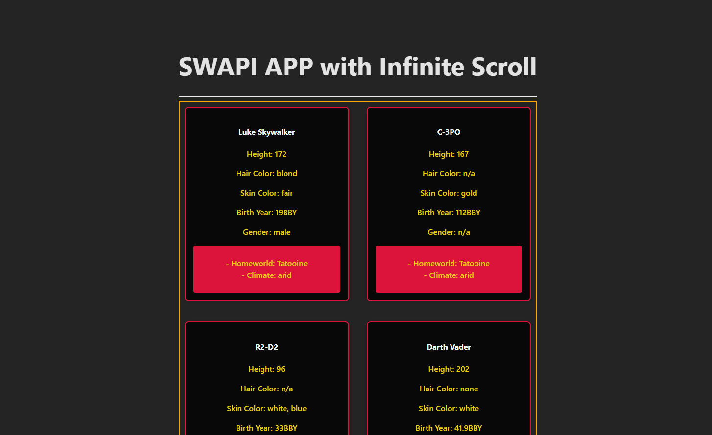
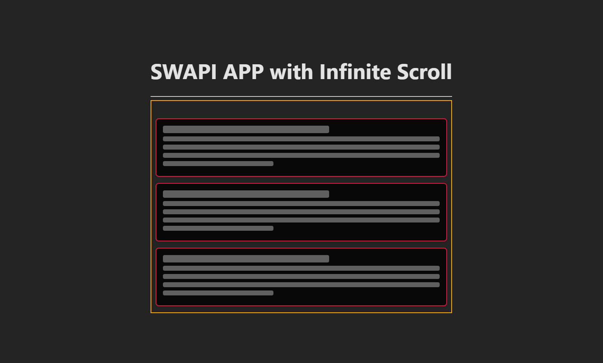

<p align="center">
  
</p>

## 📸 Screenshots

### Skeleton Loader


# Star-Wars-Infinite-Scroll-App

A React application that consumes the **SWAPI (Star Wars API)** to display characters using **Infinite Scroll** powered by the **Intersection Observer API**.   
Each character card displays detailed information, including their **homeworld**, which is fetched from a secondary API endpoint.

---

## 🚀 Live Demo
Coming soon…

---

## 🧠 Features

- ⚛️ Built with **React + Vite**
- 🔄 **Infinite Scroll** using Intersection Observer
- 🌍 Fetches **related data** (homeworld) from a secondary API
- 🦴 **Skeleton Loader** for better loading UX
- 📭 **Empty State UI** when no data is available
- 🧩 Clean separation of logic using **custom hooks**
- 🧼 Minimal, readable, and maintainable code structure

---

## 🛠️ Tech Stack

- **React**
- **Vite**
- **JavaScript (ES6+)**
- **Intersection Observer API**
- **SWAPI**
- **CSS**

---

## 🧱 Project Structure

src/
├── Card/
│ ├── CharacterSkeleton.jsx
│ └── CharacterCard.jsx
├── EmptyComponent/
│ └── EmptyState.jsx
├── Hook_component/
│ └── starWarsHook.jsx
├── Helper_component/
│ └── starWarsApi.js
├── starWarsApp.jsx
├── main.jsx

---

## ⚙️ How It Works

1. Characters are fetched page by page from SWAPI.
2. The last rendered element is observed using **Intersection Observer**.
3. When it becomes visible, the next page is automatically loaded.
4. For each character, the homeworld data is fetched and merged.
5. UI states are handled gracefully:
  - **Loading** → Skeleton Loader
  - **No data** → Empty State
  - **Data available** → Character Cards

  ---

## 🎯 Learning Goals Achieved

- Understanding custom hooks for state & side effects

- Managing multiple async requests

- Implementing Infinite Scroll without external libraries

- Improving UX with Skeleton Loaders & Empty States

- Writing scalable and readable React code
  
```md
  ## ▶️ Getting Started

Clone the repository and install dependencies:

```bash
npm install
npm run dev


🧑‍💻 Author

Jean Piero Parra
Junior / Trainee Frontend Developer
Focused on React, UX, and modern web development.
GitHub-ready
